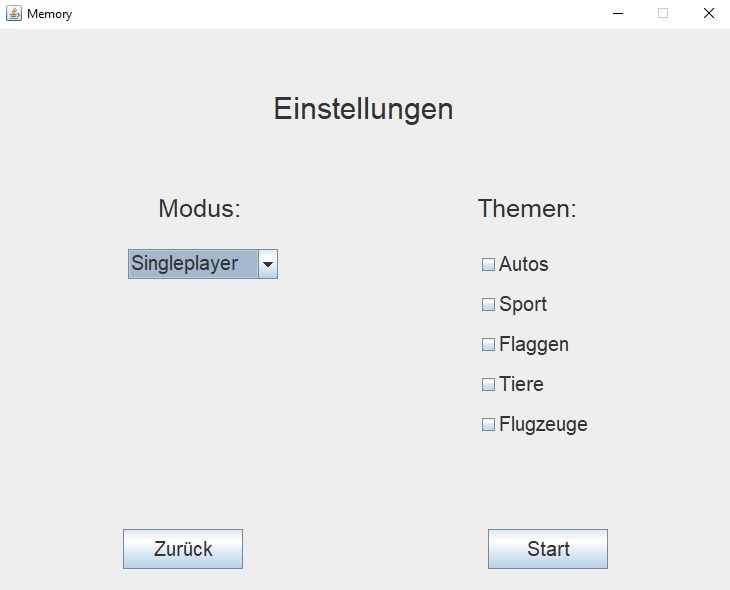
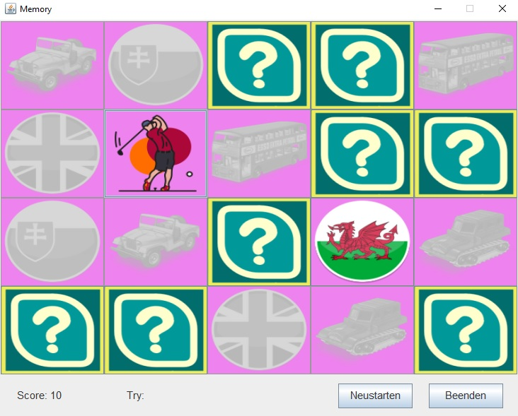
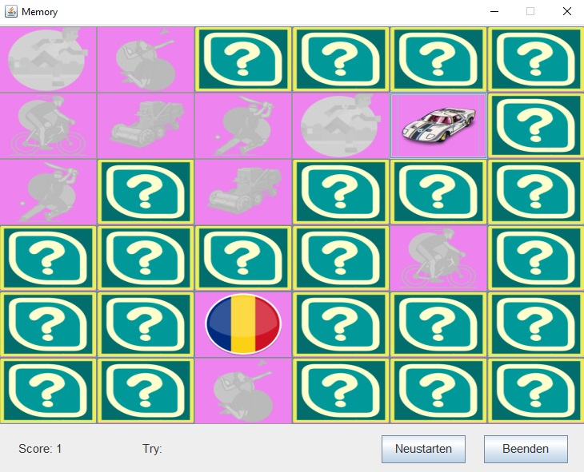
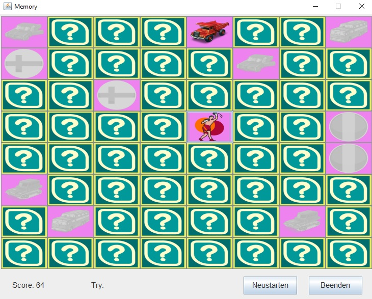

# Memory Game

This is a simple implementation of a Memory Game in Java using Swing. The game features a grid of cards, and the objective is to match pairs of cards with the same image..

### Features

- 3 Themes : `Cars`, `Sport` & `Flags`
- 3 types of difficulties

## Dependencies

- Java Swing library

### Next

- [ ] 2 player game
- [ ] Database support
- [ ] Weather API
- [X] Score tracking
- [X] Reset button to restart the game

## Screenshots

